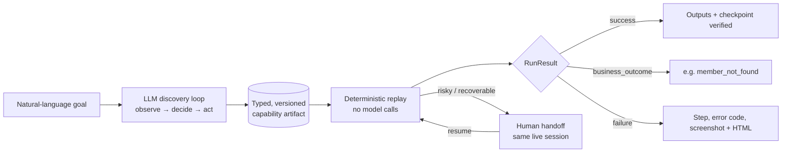

# Computer-Use Automation System

> **The model discovers. The artifact becomes a reusable capability. Deterministic replay is how an agent invokes it in production.**

   

Design write-up: [REPORT.md](REPORT.md)



## Quickstart (no API key needed)

Replay and tests do not call any model, so you can verify everything without Gemini:

```bash
pip install -r requirements.txt && playwright install chromium
python tests.py
python mock_app.py &
python automation.py replay --artifact artifacts/lookup_savings_balance.json --param member_id=67890
```

## Results at a glance

| Scenario | Input | Result status | Output |
| --- | --- | --- | --- |
| Happy path | `67890` | `success` | `$12,031.44` |
| Unknown member | `99999` | `business_outcome` | `member_not_found` |
| Permission denied | `DENIED` | `business_outcome` | `permission_denied` |
| Session expiry | `TIMEOUT` | `recoverable` | pause for human |
| Irreversible action | handoff artifact | `escalated` | human takes over the live session |

This project implements a compact record-once / replay-many automation system for applications that do not expose an API.

A discovery run accepts a natural-language goal and lets an LLM operate a real browser session. Once the goal is completed, the successful flow is converted into a typed, versioned capability artifact. Replay then executes that artifact deterministically without asking the model what to do.

The implementation is intentionally small. The focus is on discovery versus replay, artifact design, deterministic execution, runtime error semantics, safety controls, evidence capture, and live-session human handoff.

## What is implemented

- Real browser interaction with Playwright
- Screenshot plus compact UI observation during discovery
- Gemini-driven observe → decide → act loop
- Structured model responses validated with Pydantic
- Typed and versioned capability artifacts
- Parameterized runtime inputs such as `{{member_id}}`
- Declared outputs with deterministic extraction
- Prioritized locator stacks for replay
- Stable completion checkpoint verification
- Business outcomes separated from automation failures
- Recoverable session-expiry handling
- Host allowlisting and constrained action vocabulary
- Risky or irreversible action blocking
- Same-session pause → human control → resume
- JSONL execution logs
- Screenshot and HTML evidence on failure

## Project layout

```text
.
├── README.md
├── REPORT.md
├── automation.py
├── mock_app.py
├── models.py
├── run_demo.py
├── tests.py
├── requirements.txt
├── .env.example
├── .gitignore
├── artifacts/
│   ├── lookup_savings_balance.json
│   ├── lookup_savings_balance.example.json
│   └── open_subaccount_handoff.example.json
└── evidence/
    ├── discovery_20260923T195048201214Z/
    ├── replay_20260923T195100509990Z/
    └── replay_20260923T195103681875Z/
```

`lookup_savings_balance.json` was produced by a successful LLM-driven discovery run. The example artifacts are included only so the schema and handoff path can be inspected without another model call.

## Target application

The repository includes a local synthetic credit-union service console. It is deliberately plain and slightly legacy-looking so the automation is not built around a polished test application.

Supported synthetic states:

| Input | Result |
| --- | --- |
| `12345` | Valid member |
| `67890` | Valid member |
| Any unknown number | `member_not_found` business outcome |
| `DENIED` | `permission_denied` business outcome |
| `TIMEOUT` | `session_expired` recoverable condition |

The sub-account flow contains an irreversible `Create Sub-Account` control. Replay does not click it automatically unless risky execution is explicitly enabled. The intended path pauses automation and hands the same live browser session to a human operator.

## Setup

Python 3.11 or newer is recommended.

### Windows

```bash
python -m venv .venv
.venv\Scripts\activate
pip install -r requirements.txt
playwright install chromium
copy .env.example .env
```

### macOS / Linux

```bash
python -m venv .venv
source .venv/bin/activate
pip install -r requirements.txt
playwright install chromium
cp .env.example .env
```

Set the Gemini configuration in `.env`:

```text
GEMINI_API_KEY=
GEMINI_MODEL=gemini-3.5-flash-lite
TARGET_URL=http://127.0.0.1:5000
ALLOWED_HOSTS=127.0.0.1:5000,localhost:5000
```

No secret is stored in the repository. `.env` is excluded by `.gitignore`.

## Run the application

Start the local target:

```bash
python mock_app.py
```

The application runs at:

```text
http://127.0.0.1:5000
```

## Discovery run

With the target running, execute:

```bash
python automation.py discover --name lookup_savings_balance --goal "Look up member 12345 and return the current savings balance" --param member_id=12345
```

A successful discovery run creates:

```text
artifacts/lookup_savings_balance.json

evidence/discovery_<timestamp>/
├── events.jsonl
├── observation_*.json
├── screen_*.png
├── artifact.json
└── final.png
```

The generated artifact is the reusable capability. It contains the ordered actions, locator strategies, runtime inputs, declared outputs, final checkpoint, schema version, and discovery metadata. The raw model conversation is not used as executable replay logic.

## Deterministic replay

Replay the discovered capability with a different valid member:

```bash
python automation.py replay --artifact artifacts/lookup_savings_balance.json --param member_id=67890
```

Replay does not create a Gemini client and does not call an LLM. It reads the saved artifact, substitutes the runtime input, resolves each recorded target, performs the ordered actions, extracts the declared output, and verifies the checkpoint.

Observed successful result:

```json
{
  "status": "success",
  "capability": "lookup_savings_balance",
  "outputs": {
    "savings_balance": "$12,031.44"
  },
  "business_outcome": null,
  "error_code": null,
  "step_id": null,
  "message": "Replay completed and checkpoint verified"
}
```

## Known business outcome

Replay with an unknown member:

```bash
python automation.py replay --artifact artifacts/lookup_savings_balance.json --param member_id=99999
```

Observed result:

```json
{
  "status": "business_outcome",
  "capability": "lookup_savings_balance",
  "outputs": {},
  "business_outcome": "member_not_found",
  "error_code": null,
  "step_id": 4,
  "message": "No member was found for that identifier."
}
```

This is deliberately not treated as a crash. The application worked correctly and returned a meaningful domain result to the caller.

Permission denial can be exercised with:

```bash
python automation.py replay --artifact artifacts/lookup_savings_balance.json --param member_id=DENIED
```

## Human handoff

The included handoff artifact can be used without another discovery call:

```bash
python automation.py replay --artifact artifacts/open_subaccount_handoff.example.json --param member_id=12345 --param nickname=Travel
```

Replay reaches the irreversible creation control and pauses. The browser remains open on the same live session. The operator performs the manual action in that browser, returns to the terminal, records a short note, and presses Enter. Automation then resumes using the same session and verifies the final state.

The handoff evidence can contain:

```text
intervention.json
handoff_before.png
handoff_after.png
```

The browser must not be closed manually during handoff because resume depends on the existing Playwright context.

## Failure evidence

Hard replay failures produce debugging evidence such as:

```text
failure_<step>.png
failure_<step>.html
events.jsonl
result.json
```

The structured result identifies the failing step and error code. Extracted values are returned to the caller but are not written raw into the event stream.

## Safety model

Navigation is restricted to configured hosts. The artifact schema limits execution to a small action vocabulary. Discovery validates the model-selected action against the observed element capabilities. Risky or irreversible controls are not executed unattended by default.

Secrets are loaded from environment variables and excluded from version control. The logger redacts common credential and token patterns. The target application contains only synthetic data.

`--allow-risky` exists for controlled testing. The intended demo path uses human intervention instead of unattended irreversible execution.

## One-command evidence run

After configuring `GEMINI_API_KEY`:

```bash
python run_demo.py
```

The script:

1. starts the local target,
2. performs one genuine Gemini-driven discovery,
3. writes the generated capability artifact,
4. runs a successful deterministic replay with member `67890`,
5. runs a `member_not_found` replay with member `99999`,
6. shuts down the local target.

The configured default discovery model is `gemini-3.5-flash-lite`.

## Tests

Run:

```bash
python tests.py
```

The tests cover artifact validation, result semantics, parameter handling, and the navigation allowlist.

## Evidence included in this repository

The final repository keeps one coherent evidence set:

```text
evidence/discovery_20260923T195048201214Z/
evidence/replay_20260923T195100509990Z/
evidence/replay_20260923T195103681875Z/
```

These correspond to:

- one successful Gemini-driven discovery,
- one successful deterministic replay using member `67890`,
- one deterministic replay returning the `member_not_found` business outcome.

## Suggested demo order

1. Start `mock_app.py` and briefly show the synthetic service console.
2. Run discovery for member `12345` with the browser visible.
3. Open `artifacts/lookup_savings_balance.json` and explain the capability contract.
4. Replay with member `67890` and show the returned savings balance.
5. Replay with `99999` and show the `member_not_found` business outcome.
6. Run the handoff artifact and demonstrate pause → manual control → resume.
7. Show the evidence folders and explain how discovery and replay are separated.
